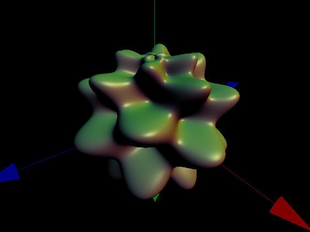
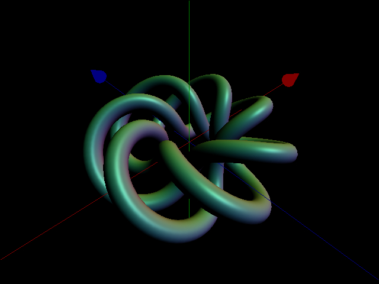
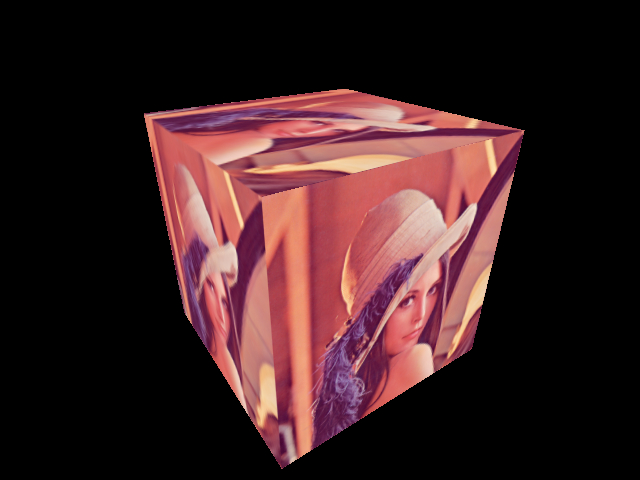
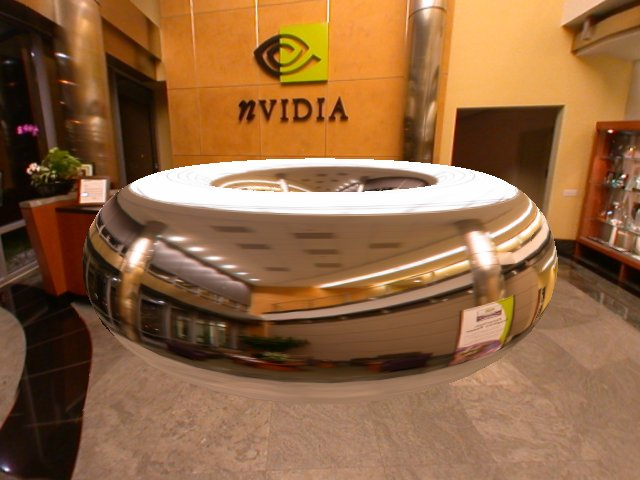
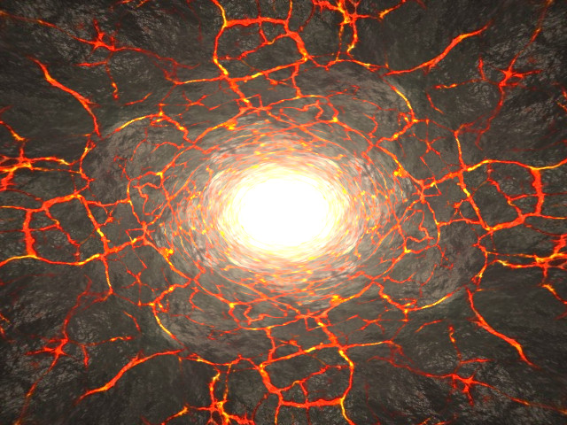

# eduraster

Eduraster is a personal project that I did for self-teaching purposes, and was the result of my study in computer graphics. My main objective was to understand how it works the graphics pipeline of rasterization APIs like OpenGL and Direct3D, so I wrote a software rasterizer from scratch. Because the project was mainly focused on learning, it was written entirely in C code without any kind of low-level optimizations.

### Main features:

* Scanline rasterization with subpixel accuracy. Bottom-left fill convention. Floating Point arithmetic.
* Pixel Center on integers XY values. Lower left window coordinates.
* Right Hand Coordinate System.
* Perspective correct interpolation of vertex attributes.
* Depth buffering.
* Homogeneous Clipping.
* Support for points, lines and triangles. Geometry processing in batches.
* Wireframe and solid rendering.
* Backface culling.
* Support for begin/end style commands.
* Support for Vertex Arrays with indexed and non-indexed buffers.
* Programable pipeline: Support for Vertex Shaders, Fragment Shaders, and homogeneous division using function pointers.
* Support for modelview and projection matrix stacks.
* Utility routines for matrix and vector operations.
* Utility routines for affine transformations and projections.
* Texturing support:
  * Formats: Floating point textures, from 1 to 4 components.
  * Texture targets: 1D, 2D and cubemaps.
  * Filtering: Point sampling, bilinear and trilinear filtering (Per pixel mipmapping). Generation of mipmaps.
  * Wrapping modes: Repeat, Clamp to edge.
  * Texture sampling on vertex and fragment stages.
  * Render to texture.

### Samples

SDL 2.0.14 is used to create a window, display buffer of pixels, handle keyboard and mouse events, and load images from disk. (https://www.libsdl.org/download-2.0.php)
A simple script (build.bat) is provided to compile with gcc using MinGW (http://mingw-w64.org/doku.php) on Windows.

#### Single Triangle

Drawing of a single triangle with linear interpolation of vertex colors. Used begin/end commands.

#### Surface plot

Parsing, calculation and drawing of parametric surfaces entered by keyboard. Rendering of primitives from vertex arrays and indices.
Phong shading with a main directional light, with diffuse and specular components.

#### Tubeplot

Constructs a tube along a curve entered by keyboard. Rendering of primitives from vertex arrays and indices.
Phong shading with a main directional light, with diffuse and specular components.

#### Textured Cube

Texture mapped cube. Perspective correct interpolation of texture coordinates. 
Calculation of perspective correct derivatives for trilinear filtering. Backface culling.

#### Environment Mapping

Environment mapped torus and skybox. Sampling of cubemap texture with normal vector in object space.

#### Tunnel Effect

Drawing of 2 triangles that cover the entire screen and a fragment shader to generate a tunnel effect with varying color brightness.
Calculation of analytics derivatives for trilinear filtering.

