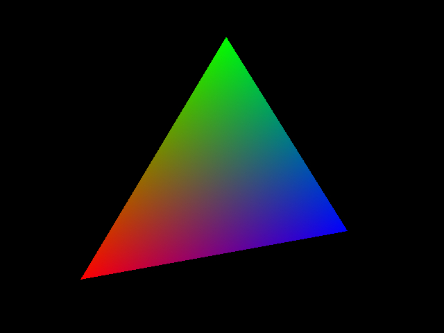

# eduraster

EduRaster is a personal project I've been doing by self-teaching, and is the result of my theoretical studies in mathematics, algorithms and computer graphics techniques. The main goal is to learn how works the graphics pipeline of libraries such as OpenGL and Direct3D, and for that I programmed from scratch a software rasterizer. Because the project is mainly focused on learning, it is written entirely in C code without any kind of low-level optimizations.

### Main features:

* Scanline rasterization with subpixel accuracy. Bottom-left fill convention. Floating Point arithmetic.
* Pixel Center on integers XY values. Lower left window coordinates.
* Right Hand Coordinate System.
* Perspective correct interpolation of vertex attributes.
* Depth buffering.
* Homogeneous Clipping.
* Support for points, lines and triangles. Geometry processing in batches.
* Wireframe and solid rendering.
* Backface culling.
* Support for begin/end style commands.
* Support for Vertex Arrays with indexed and non-indexed buffers.
* Programable pipeline: Support for Vertex Shaders, Fragment Shaders, and homogeneous division using function pointers.
* Support for modelview and projection matrix stacks.
* Utility routines for matrix and vector operations.
* Utility routines for affine transformations and projections.
* Texturing support:
  * Formats: Floating point textures, from 1 to 4 components.
  * Texture targets: 1D, 2D and cubemaps.
  * Filtering: Point sampling, bilinear and trilinear filtering (Per pixel mipmapping). Generation of mipmaps.
  * Wrapping modes: Repeat, Clamp to edge.
  * Texture sampling on vertex and fragment stages.
  * Render to texture.

### Samples

SDL 2.0.4 is needed to compile and run the samples. (https://www.libsdl.org/download-2.0.php).

#### Single Triangle

Drawing of a single triangle with linear interpolation of vertex colors. Used begin/end commands.

#### Surface plot

#### Tubeplot

#### Textured Cube

#### Environment Mapping
